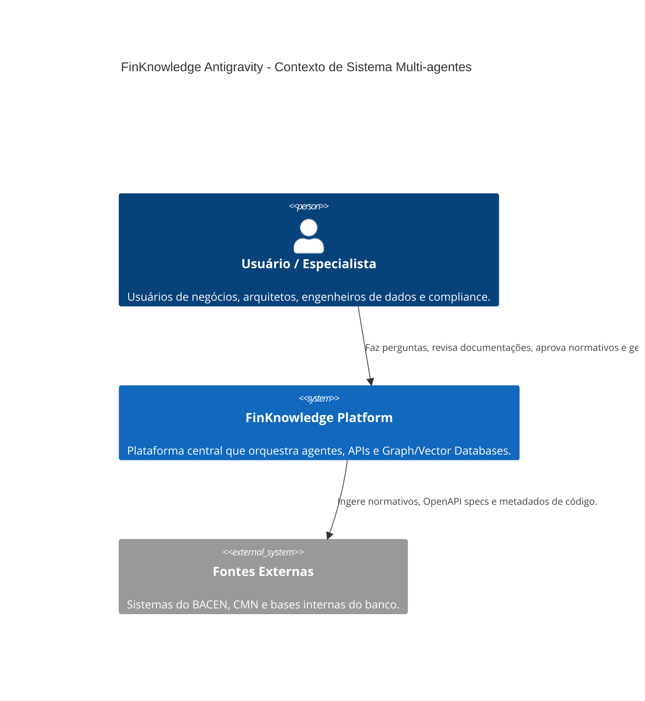
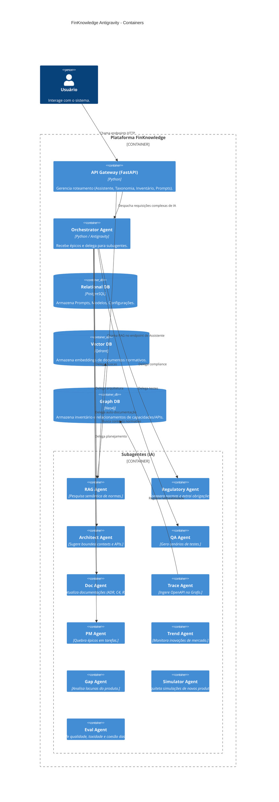

# FinKnowledge Antigravity - Manual de Uso do Sistema

Este documento descreve a arquitetura macro do sistema e detalha as responsabilidades entre Inteligência Artificial e a interação Humana, baseado no conceito de Multi-agentes com o Google Antigravity SDK.

## Arquitetura do Sistema (C4 Model)

### Containers (Macro-Visão)

## Divisão de Responsabilidades (Humano vs IA)

A plataforma baseia-se num fluxo **"Human-in-the-Loop"**.

### Responsabilidades da IA
- **Monitoramento e Ingestão:** Buscar ativamente mudanças em fontes normativas e código.
- **Classificação e Extração:** Criar resumos, gerar vetores e extrair entidades usando o `parser` e `collector`.
- **Análise Arquitetural e de QA:** Sugerir estruturas, microserviços e cenários de testes automatizados com base nas regras de negócio.
- **Auto-Documentação:** Re-escrever documentações e gerar diagramas dinamicamente, enviando como Pull Requests.
- **Rastreabilidade (Graph):** Conectar endpoints, serviços e domínios automaticamente a partir de repositórios e OpenAPI.

### Responsabilidades do Humano
- **Curadoria Inicial:** Configurar os Prompts e Agentes através do *Prompt Registry*.
- **Validação Crítica:** O *Regulatory Agent* identifica itens de alto impacto regulatório. O Humano **deve** aprovar o relatório de impacto gerado antes da propagação no grafo.
- **Revisão de Arquitetura:** O *Architect Agent* sugere arquiteturas que devem ser validadas e refinadas por engenheiros Sêniores.
- **Merges e Deploys:** A IA apenas propõe e cria Pull Requests; a aprovação e deploy final continuam sob responsabilidade humana (Tech Leads).

---
*Gerado dinamicamente através do Antigravity IDE Agent para o projeto FinKnowledge Base.*
